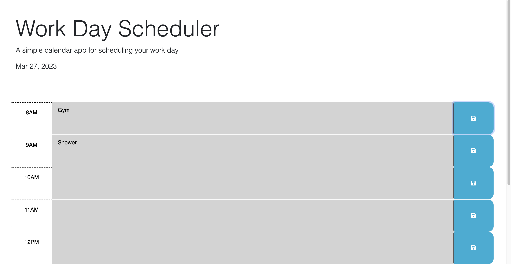

# Scheduler
## Description
This Scheduler displays the current day using a third-party API. It shows the current business hours that allows you to save text in the local storage. Blocks with turn different colors depending on if time is past, present , or future.

## URL
https://annaleebeltran.github.io/Scheduler/

## Usage

Scheduler utilizes third-party APIS like J-Query to help get current time of day.

## License

Please refer to the LICENSE in the Scheduler repository.